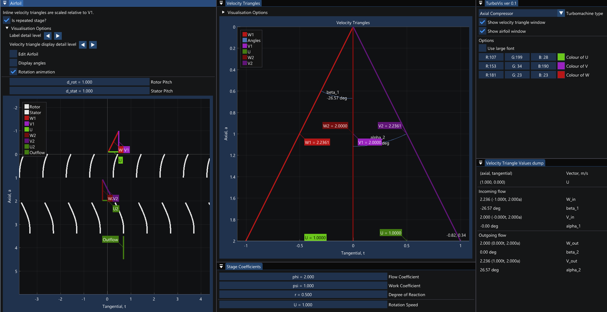

# TurboVis
A turbomachine visualisation tool, made for the TU Delft AE4206 Turbomachinery course.
Enables real-time exploration and experimentation of load-coefficient based turbomachine design.

## Installation
### Windows
Download the Windows binary and extract it to a directory on your computer together with the *turbovis.ini* file.
The provided file is a 32-bit executable that should run on both x64 and x86 systems.

### Ubuntu (x64)
Move the binary executable and the *turbovis.ini* file to a directory on your computer. Depending on your desktop, you might be able to doubleclick the program to run it. Otherwise, you can always run the program as *./TurboVis*.

If you place the program (along with the ini) in */usr/bin/*, you will be able to call it from anywhere using a simple *TurboVis*.

In case you experience problems with permissions, be sure to check if the program is set to allow execution, and if not change it using *chmod +X TurboVis*.

### Other platforms
For other platforms, full source code is available, and it should build on most systems.
As the program runs on an **OpenGL** backend, building requires your system to have dev opengl headers available. For debian-based systems you can for example use *freeglut3-dev*, but windows and apple should have these preinstalled. All other dependencies are already present in the source code.
Building is straightforward using [CMake](https://cmake.org/), and then compiling it using your favourite compiler.

## Libraries used

* [Dear IMGui](https://github.com/ocornut/imgui)
* [implot](https://github.com/epezent/implot)
* [GLFW](https://www.glfw.org/)
